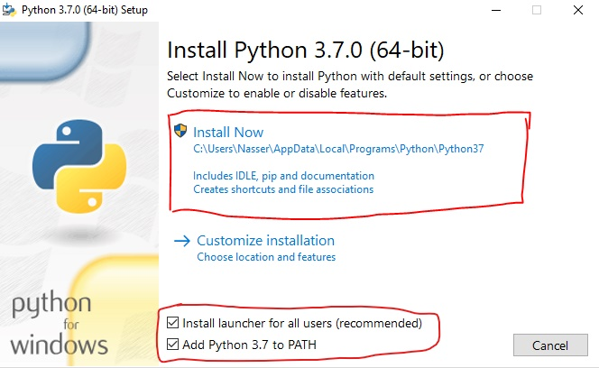

IslamApp
========

IslamApp est une application islamique qui a pour but d'édifier les internautes sur l'islam et
enseigner aux musulmans la religion de l'islam.

# Historique:

- La version 1.0.0 fût dévelopé en 2014 mais n'a pas connu de succès
- La version 2.0.0 fût développé en 2018 mais n'a pas été mis en production
- Ceci est la version 3.0.0

# Fonctionnalités

- Thématiques mensuelles
- Questions / Réponses
- Calendrier musulman et horaire des prières par ville
- Articles de blog, audios et vidéos
- Programmes des émissions audios visuels
- Géolocalisation (mosquées, restaurants, écoles islamiques)

# Technologies

- Python-3.7 / Flask
- Javascript / JQuery
- SQL database
- Progressive Web Application

# Architecture de l'application

Il s'agit d'une application client - serveur en mode web service (REST API).
- Le dossier **application** contient le code source de l'application. Dans ce dossier on retrouve:
    - **local_config.py**: il contient les configurationss de base de l'application
    - **plugins**: ce dossier contient les modules métiers de l'application (fichiers statiques, geolocalisation, themes, etc...)
    - **core**: il contient les scripts et autres codes utiles au fonctionnement de l'application
    - **api**: il contient toutes les api de l'application
    - **models**: il contient tous les modèles de l'application. C'est la représentation de la BD via SQLAlchemy

# Comment installer l'application?

## Sur Windows 10 (64 bits)

1. Installer Python 3.7.0: https://www.python.org/ftp/python/3.7.0/python-3.7.0-amd64.exe
Au lancement de l'installation, choisissez les options tels que définis ci dessous



Après installation, Python37 sera présent dans le répertoire C:\Users\VotreNomUtilisateur\AppData\Local\Programs\Python\Python37

2. Une fois installer vous pouvez exécuter Python37 ou PIP37 en tapant l'une de ces commandes

    ```
    py -3.7 # pour exécuter Python37
    py -3.7 -m  pip # pour exécuter PIP37
    ```

3. Créer votre _virtualenv_ dans lequel vous allez travaillez sur le projet

    ```
    py -3.7 -m  venv \chemin\vers\votre\dossier\de\projet
    ```

4. Activer le virtualenv en tapant la commande suivante

    ```
     \chemin\vers\votre\dossier\de\projet\Scripts\activate
    ```

5. Ensuite il faut mettre à jour PIP

  ```
   python -m pip install --upgrade pip
  ```

6. Installer git si vous ne l'avez pas encore fait

7. Cloner le dépôt du projet

    ```
    git clone https://github.com/proxima-cm/IslamApp.git
    ```

8. Installer les dépendances de l'application

    ```
    cd IslamApp
    pip install -r requirements.txt
    ```

# Comment exécuter l'application?

1.  Activer le virtualenv si ce n'est pas encore fait

    ```
     \chemin\vers\votre\dossier\de\projet\Scripts\activate
    ```

2. Vous pouvez maintenant démarrer l'application

    ```
    python run.py
    ```

3. Ouvrez votre navigateur et tapez l'adresse http://localhost:5000/


# Bon à savoir
- La branche dev est la branche principale de développement et des tests
- La branche master est la branche qui est en production (release)
- Le versionning sera géré suivant la gestion sémantique de version. Chaque version
sera matérialisé par 3 chiffres (x, y, z) où x est la version majeur de l'application,
y représentant la modification au niveau d'un module et z représentant la correction d'un bug
ou une modification mineure qui ne change pas un comportement au niveau de l'application.
- Nous utilisons Travis CI comme outil d'intégration continue. Il va permettre de compiler, tester
et déployer le code source.


# Comment contribuer?

1. Vous pouvez ajouter un **issue** (fonctionnalité, correction de bug, avis, etc...)
2. Vos contributions doivent apparaitre dans les **issues** avant d'être soumises
3. Les soumissions se font par **Pull request** uniquement
4. Pour contribuer au code source, veuillez cloner le dépot puis créer une branche avec cette structure: **VotreNom_Type_Fonctionnalité**. Type peut être: **feat**, **fix**, **docs**, **style**, **refactor**, **test**, **core** comme indiqué plus bas
5. Si vous rencontrez un bug (erreur), veuillez soumettre une **issue** en précisant:
  - Le module affecté
  - La procédure effectuée pour obtenir le bug
  - Une capture d'écran de l'erreur
  - Soyez explicites

# Git Commit Message Style Guide

```
type: subject

body

footer
```

## Type
The type is contained within the title and can be one of these types:
- feat: a new feature
- fix: a bug fix
- docs: changes to documentation
- style: formatting, missing semi colons, etc; no code change
- refactor: refactoring production code
- test: adding tests, refactoring test; no production code change
- core: updating build tasks, package manager configs, etc; no production code change

### Subject
Subjects should be no greater than 50 characters, should begin with a capital letter and do not end with a period.

Use an imperative tone to describe what a commit does, rather than what it did. For example, use **change**; not changed or changes.

### Body
Not all commits are complex enough to warrant a body, therefore it is optional and only used when a commit requires a bit of explanation and context. Use the body to explain the what and why of a commit, not the how.

When writing a body, the blank line between the title and the body is required and you should limit the length of each line to no more than 72 characters.

### Footer
The footer is optional and is used to reference issue tracker IDs.
